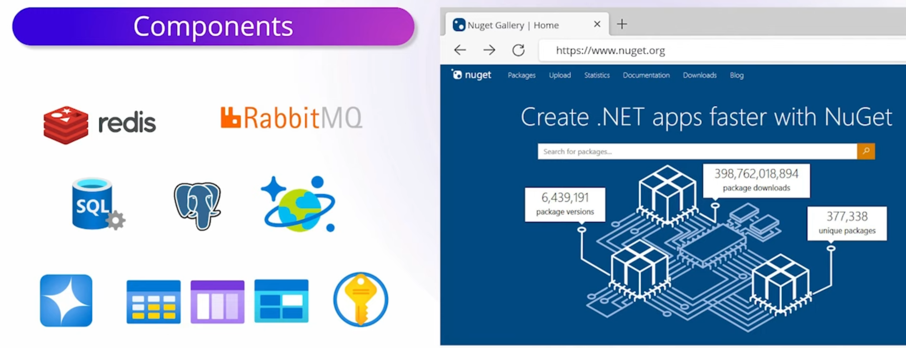

# Gateway patterns

[!INCLUDE [download-alert](../includes/download-alert.md)]

# .NET Aspire Components: Empowering Cloud-Native Applications

**Figure 3-5**. Examples of .NET Aspire components.

.NET Aspire components are curated **NuGet packages** that handle specific cloud-native concerns. These components connect seamlessly with your app, ensuring consistent integration with services such as Redis, PostgreSQL, and more.

Here is a list of popular .NET Aspire components:

1. **Apache Kafka**: The `Aspire.Confluent.Kafka` package allows you to produce and consume messages from an Apache Kafka broker.

2. **Azure AI OpenAI**: Use the `Aspire.Azure.AI.OpenAI` library to access Azure AI OpenAI or OpenAI functionality.

3. **Azure Search Documents**: The `Aspire.Azure.Search.Documents` package provides access to Azure AI Search.

4. **Azure Blob Storage**: Connect to Azure Blob Storage using the `Aspire.Azure.Storage.Blobs` library.

5. **Azure Cosmos DB Entity Framework Core**: Access Azure Cosmos DB databases with Entity Framework Core using `Aspire.Microsoft.EntityFrameworkCore.Cosmos`.

6. **Azure Event Hubs**: The `Aspire.Azure.Messaging.EventHubs` package enables access to Azure Event Hubs.

7. **Azure Key Vault**: Securely access Azure Key Vault using the `Aspire.Azure.Security.KeyVault` library.

8. **Azure Service Bus**: Communicate with Azure Service Bus via the `Aspire.Azure.Messaging.ServiceBus` package.

9. **Azure Storage Queues**: Use the `Aspire.Azure.Storage.Queues` library to interact with Azure Storage Queues.

10. **Azure Table Storage**: Access the Azure Table service with the `Aspire.Azure.Data.Tables` package.

11. **MongoDB Driver**: Connect to MongoDB databases using the `Aspire.MongoDB.Driver` package.

12. **MySqlConnector**: Access MySqlConnector databases with the `Aspire.MySqlConnector` library.

13. **NATS**: The `Aspire.NATS.Net` package provides access to NATS messaging.

14. **Pomelo MySQL Entity Framework Core**: Use `Aspire.Pomelo.EntityFrameworkCore.MySql` to work with MySql databases via Entity Framework Core.

15. **Oracle Entity Framework Core**: Access Oracle databases with Entity Framework Core using `Aspire.Oracle.EntityFrameworkCore`.

These components simplify connections to popular services and platforms, handle cloud-native concerns, and ensure standardized configuration patterns. Remember to use the latest versions of .NET Aspire components to benefit from the latest features and security updates.

>[!div class="step-by-step"]
>[Previous](service-discovery.md)
>[Next](observability-and-dashboard.md)
