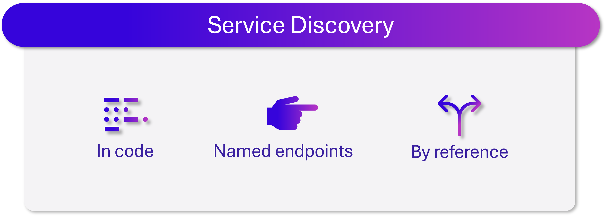

# Service discovery

[!INCLUDE [download-alert](../includes/download-alert.md)]



**Figure 3-4**. Service discovery in .NET Aspire.

In the world of distributed applications, services often need to communicate with each other over the network. Whether you're developing locally or in the cloud, ensuring that services can find and connect to each other is crucial. **.NET Aspire** provides a powerful service discovery mechanism that simplifies this process.

## Why Service Discovery Matters

Imagine a microservices-based application with multiple components: authentication, catalog, basket, and frontend services. These services need to interact with each other, but their endpoints (such as different ports or URLs) can change dynamically. Service discovery helps address this challenge by providing a way for services to locate and communicate with one another.

## Implicit Service Discovery by Reference

In .NET Aspire, service discovery configuration is added only for services that are **referenced** by a given project. Let's consider an example:

```csharp
var builder = DistributedApplication.CreateBuilder(args);
var catalog = builder.AddProject<Projects.CatalogService>("catalog");
var basket = builder.AddProject<Projects.BasketService>("basket");
var frontend = builder.AddProject<Projects.MyFrontend>("frontend")
    .WithReference(basket)
    .WithReference(catalog)
    WithExternalHttpEndpoints();
```

In this example:
- The `frontend` project references both the `catalog` and `basket` projects.
- The `.WithReference()` calls instruct the .NET Aspire application to pass service discovery information for the referenced projects (i.e., `catalog` and `basket`) into the `frontend` project.

## Named Endpoints

Some services expose multiple **named endpoints**. These endpoints can be resolved by specifying the endpoint name in the host portion of the HTTP request URI. The format is `scheme://_endpointName.serviceName`. For instance:

```csharp
builder.Services.AddHttpClient<BasketServiceClient>(client =>
    client.BaseAddress = new Uri("https://basket"));
builder.Services.AddHttpClient<BasketServiceDashboardClient>(client =>
    client.BaseAddress = new Uri("https://_dashboard.basket"));
```

In this example:
- We configure two `HttpClient` classes—one for the core basket service and another for the basket service's dashboard.
- The `_dashboard` endpoint is resolved via `https://_dashboard.basket`.

## Configuration-Based Endpoint Resolver

With the configuration-based endpoint resolver, named endpoints can be specified in configuration files. For example, in `appsettings.json`:

```json
{
  "Services": {
    "basket": "https://10.2.3.4:8080", // Default endpoint (requested via https://basket)
    "dashboard": "https://10.2.3.4:9999" // "dashboard" endpoint (requested via https://_dashboard.basket)
  }
}
```

In this JSON:
- The default endpoint resolves to `10.2.3.4:8080` when using `https://basket`.
- The "dashboard" endpoint resolves to `10.2.3.4:9999` when requested via `https://_dashboard.basket`.

>[!div class="step-by-step"]
>[Previous](orchestration.md)
>[Next](components.md)
